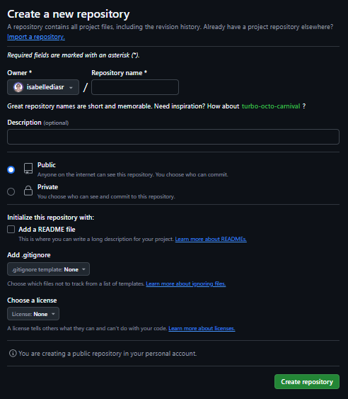
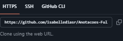

<!-- Fazer uma documentação de um passo a passo de como estruturar um projeto (como montar o GitHub, como você comitar, como estruturar o projeto Django, que sites usar para fazer a documentação, por exemplo, bookstack, etc.). -->

# Estruturando um projeto

## 1 - Início do Projeto

### 1.1 Propósito
\- Essa é a etapa onde reunimos a equipe envolvida no projeto e realizamos um **brainstorming**, que nada mais é que a contribuição de todos os participantes para gerar novas ideias e soluções. Na discussão do projeto é a parte onde identificamos os **problemas**, quais são os **propósitos** e **objetivos** que projeto o projeto vai abordar.

### 1.2 Levantamento de Requisitos

\- Diferente da etapa anterior, onde entendemos o **porque** do projeto, no **levantamento de requisitos**, determinamos **o que** será feito no projeto.

\- Nessa etapa detalhamos o que precisa ser feito para a realização do projeto e definimos também os requisitos.

➡️ **O que é definido no Levantamento de Requisitos**:

| **Categoria** | **O que é Definido** | **Exemplo** |
| :---: | :---: | :---: |
| **Requisitos Funcionais** | O que o sistema deve fazer. | Cadastro de usuários, geração de relatórios, envio de notificações. |
| **Requisitos Não Funcionais** | Como o sistema deve se comportar em termos de desempenho, segurança e qualidade. | Tempo de resposta inferior a 2 segundos, suporte a 10.000 usuários simultâneos. |
| **Regras de Negócio** | Restrições ou especificidades baseadas em contexto organizacional ou legal. | Cálculo de impostos específicos, políticas de desconto baseadas em volume. |
| **Restrições Técnicas** | Limitações impostas por tecnologias ou ambiente operacional. | Uso obrigatório de um framework, integração com sistemas legados. |
| **Expectativas dos Stakeholders** | Necessidades, preferências e prioridades dos usuários e interessados no projeto. | Interface intuitiva, funcionalidades mais críticas identificadas como prioridade. |
| **Critérios de Aceitação** | Como validar que os requisitos foram atendidos. | "O relatório deve ser gerado em menos de 30 segundos e incluir dados específicos." |

### 1.3 Planejamento e Organização

\- Etapa na qual são definidas as equipes, funções de cada participante e atribuir responsabilidades. Uma boa estruturação é fundamental para que cada participante se desenvolva durante o projeto.

## 2 - Desenvolvimento

Na estruturação de um projeto, é muito importante manter boas práticas.

### 2.1 Divida o Projeto em Apps
* Divida funcionalidades em módulos (apps) independentes. Cada app deve ser focado em uma funcionalidade específica (ex: app de usuários, app de produtos, app de pagamento).

### 2.2 Configurações no `settings.py`
* Não deixe configurações sensíveis diretamente em `settings.py`. Use variáveis de ambiente (com bibliotecas como `django-environ`) para armazenar informações como credenciais de banco de dados e chaves secretas.
* Use `settings_local.py` para configurações específicas de desenvolvimento.

### 2.3 Organize Templates e Arquivos Estáticos
* Crie subpastas dentro de `templates` e `static` para cada aplicação, facilitando a organização e reutilização.

### 2.4 Migrações e Banco de Dados
* Use **migrations** para alterar o banco de dados sem perder dados ou comprometer a integridade do banco. Evite manipulações manuais no banco de dados sempre que possível.

### 2.5 Testes
* Tenha testes unitários e testes de integração para garantir que o código esteja funcionando corretamente. O Django já oferece uma estrutura de testes (usando `unittest`).

### 2.6 Utilize o Admin
* Use o painel de administração do Django para gerenciar rapidamente dados e testar modelos.

### 2.7 Versionamento de Código
* Utilize um sistema de controle de versão (como **Git**) para gerenciar e colaborar no código.

## 3 - GitHub

\- Nessa etapa utilizamos do Git e GitHub para desenvolver o projeto. O **Git** é um sistema de controle de versão distribuído que permite gerenciar o histórico de versões de arquivos e colaborar com outras pessoas, já o **GitHub** é uma plataforma de hospedagem de código-fonte que usa Git para controle de versão e facilita o compartilhamento e colaboração em projetos.

### 3.1 Criação do Repositório

\- Na aba **"Repositóries"**, aba onde você vai encontrar os repositórios, crie um novo repositório clicando no botão "New", um botão parecido com o da foto a seguir: 


\- Em seguida, preencha as informações que apareceram como na seguinte tela:



\- Escolha um nome para o repositório, por exemplo, meu-projeto.

\- Opcionalmente, adicione uma descrição.

\- Escolha se o repositório será público ou privado.

\- Se desejar, adicione um arquivo README e uma licença.

### 3.2 Clonando o repositório do GitHub

\- Para clonar um repositório existente, após abrir o **Git Bash** na pasta desejada, pasta colocar o seguinte código juntamente com o URL do Repositório GitHub:



```git
git clone https://github.com/usuario/repositorio.git
```

### 3.3 Usando as Branches

\- As branches são como cópias separadas do código principal onde vocês pode fazer mudanças sem afetar o código principal.

\- Para criar uma nova **branch** basta escrever o seguinte código no **Git Bash**: 

```
git checkout -b nova-funcionalidade    
```

\- Para enviar a **branch** para o GitHub basta escrever o seguinte código no **Git Bash**: 

```
git push origin nova-funcionalidade

```

### Alguns comandos comuns do Git são:

| **Comando** | **Descrição** |
| :---: | :---: |
| `git init` | Inicializa um repositório Git no diretório atual |
| `git add .` | Adiciona todos os arquivos modificados ao repositório |
| `git commit -m "mensagem"` | Cria um commit com a mensagem fornecida |
| `git status` | Mostra o status atual do repositório |
| `git push origin master` | Envia alterações para o repositório remoto (GitHub) |
| `git pull origin master` | Atualiza o repositório local com alterações do remoto |
| `git branch nome-da-branch` | Cria uma nova branch |
| `git checkout nome-da-branch` | Muda para a branch especificada |
